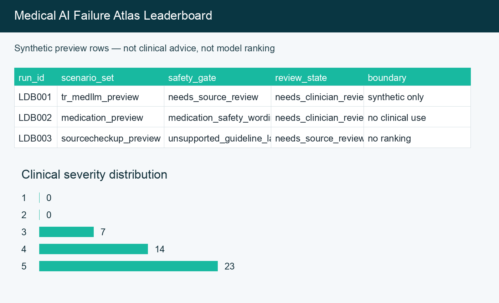

# Medical AI Failure Atlas

A clinician-built benchmark for medical AI safety evaluation.

[](pyproject.toml) [](LICENSE) [](leaderboard/SPACE_README.md)


<!-- Legacy validator anchor:  -->

Medical AI Failure Atlas is a synthetic benchmark for testing whether medical AI systems handle safety critical wording, missing variables, escalation boundaries, and source support. A clinician created the cases so model builders can see failure patterns that matter in medical review without using patient data. The project gives researchers, evaluators, and open source maintainers a practical way to inspect medical safety behavior before public claims or downstream use.

## Table of Contents

1. [Quick Start](#quick-start)
2. [What This Evaluates](#what-this-evaluates)
3. [What Is Inside](#what-is-inside)
4. [Repository Structure](#repository-structure)
5. [Example Workflows](#example-workflows)
6. [Who Is This For](#who-is-this-for)
7. [Safety Boundaries](#safety-boundaries)
8. [Roadmap](#roadmap)
9. [Contributing](#contributing)
10. [License](#license)
11. [Citation](#citation)

## Live Demo

The leaderboard app is deploy-ready for HuggingFace Spaces. Public deployment should use a professional account or organization handle.

Local preview:

```bash
python3 -m pip install -r requirements.txt
python3 app.py
```

See [`leaderboard/SPACE_README.md`](leaderboard/SPACE_README.md) for Space metadata and deployment boundaries.

## Quick Start

Run the public checks and generate the current leaderboard preview:

```bash
python3 -m venv .venv && source .venv/bin/activate
python3 -m pip install -r leaderboard/requirements.txt
make validate-public leaderboard_report
```

Run the local leaderboard app:

```bash
python3 leaderboard/app.py
```

## What This Evaluates

The benchmark focuses on failure modes that clinicians and safety reviewers need to catch before a model answer becomes trusted language:

1. Missing clinical variables.
2. Unsafe escalation wording.
3. Overconfident protocol language.
4. Weak source support.
5. Confusing Turkish medical wording.
6. Claims that sound like validation, deployment, ranking, or endorsement without evidence.

The public release uses synthetic scenarios only. It does not contain patient records, private clinical text, raw private model logs, or clinical deployment evidence. Raw model outputs and logs are not included in the public release.

The public prompt files currently form a 70 row prompt set across the v1, hard 30, and scale 30 prompt files.

## What Is Inside

| Area | Path | Purpose |
| --- | --- | --- |
| Synthetic evaluation data | `data/` | Prompt sets, scenario banks, scoring rubrics, and public synthetic samples. |
| Failure atlas | [`failure_atlas/public/`](failure_atlas/public/INDEX.md) | Taxonomy preview, case intake schema, [methodology](failure_atlas/public/METHODOLOGY.md), and review queue. |
| SourceCheckup Medical | `sourcecheckup/` | Source support checks for medical AI answers and public claim review. |
| Turkish MedLLM safety bench | `tr_medllm_safetybench/` | Turkish medical language risk pack and specialty spread summary. |
| Leaderboard preview | `leaderboard/` | Synthetic no ranking report template and deployable Space app. |
| Review rubric | `rubric/v0.2.0/` | Clinician severity rubric and safety gate taxonomy for the flagship layer. |
| Validation scripts | `scripts/` | Deterministic checks for data shape, release boundaries, and generated reports. |
| Documentation | `docs/` | Method notes, release cards, governance worksheets, and archived field work. |

## Repository Structure

```text
medical-ai-failure-atlas/
  data/                         synthetic scenario and rubric files
  failure_atlas/public/         public taxonomy and case intake materials
  leaderboard/                  preview report and HuggingFace Space app
  rubric/v0.2.0/                clinician severity rubric and safety gate taxonomy
  scripts/                      validators, runners, and report generators
  sourcecheckup/                source support review tool
  tr_medllm_safetybench/        Turkish medical LLM safety pack
  docs/                         documentation and planning notes
```

## Example Workflows

Validate the public release:

```bash
make validate-public
```

Generate the no ranking leaderboard report:

```bash
make leaderboard_report
```

Run an OpenAI compatible endpoint against a prompt set:

```bash
python3 scripts/run_prompt_set_openai_compatible_v2.py --help
```

Run a Hugging Face Transformers model against a prompt set:

```bash
python3 scripts/run_prompt_set_hf_transformers_v2.py --help
```

Run the benchmark review pipeline:

```bash
python3 scripts/benchmark_runner.py --help
```

## Who Is This For

1. Open source model maintainers who want medical safety feedback without patient data.
2. Benchmark teams comparing model behavior across safety gates.
3. Clinicians reviewing model answers for escalation, wording, and source support risk.
4. Medical AI researchers who need transparent synthetic cases and reproducible checks.
5. Turkish medical AI contributors who need a benchmark that includes Turkish clinical wording risks.

## Safety Boundaries

Use this repository for research, evaluation, documentation review, and model development feedback.

Do not use it for diagnosis, treatment advice, clinical deployment, patient triage, regulatory approval, ranking claims, score certification, source truth certification, partner claims, institution claims, or endorsement claims.

All public scenarios are synthetic. If you contribute examples, use synthetic or public information only.

## Roadmap

The next public work is narrow and practical:

1. Deploy the interactive leaderboard on HuggingFace Spaces under a professional account or organization.
2. Publish the clinical severity rubric and safety gate taxonomy.
3. Keep the leaderboard focused on safety gates instead of model ranking.
4. Expand clinician-reviewed synthetic cases after rubric review.
5. Build the preprint into a public technical report after reference verification.

See [docs/LEADERBOARD_PLAN.md](docs/LEADERBOARD_PLAN.md) for the Space deployment plan.

## Contributing

Read [CONTRIBUTING.md](CONTRIBUTING.md) before opening a pull request. Use synthetic examples only and keep claims narrow. A useful contribution usually adds one clear failure case, one source support check, one validator fix, or one documentation improvement.

## License

Code in this repository is licensed under Apache-2.0.

Synthetic scenario data, documentation, evaluation cards, and other non code text are licensed under CC-BY-4.0 unless a file says otherwise.

See [LICENSE](LICENSE) for the full license notice.

## Citation

If you use this resource, cite:

```bibtex
@dataset{ozkan2026medical_ai_failure_atlas,
  title = {Medical AI Failure Atlas},
  author = {Ozkan, Goktug},
  year = {2026},
  version = {0.2.0},
  url = {https://github.com/goktugozkanmd/medical-ai-failure-atlas}
}
```

The repository also includes machine readable citation metadata in [CITATION.cff](CITATION.cff).
